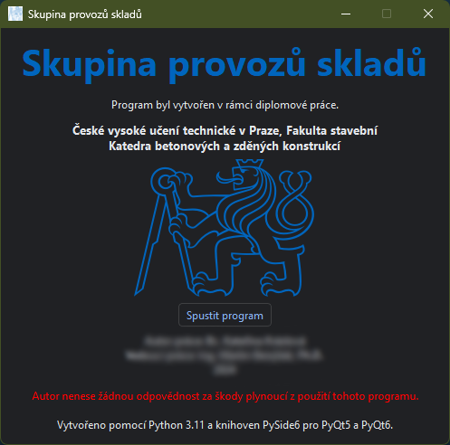
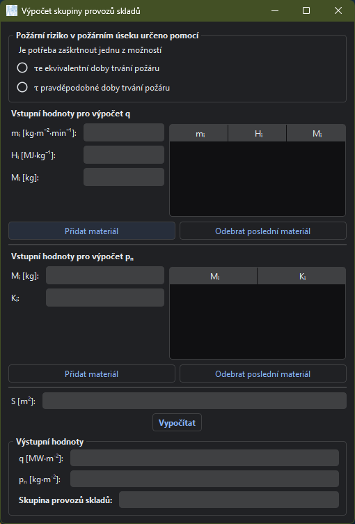

# Skupina provozu skladů

Jednoduchý program pro výpočet kategorizace skladů pomocí normy ČSN XYZ. Používá jednoduché Gui napsané v Pythonu s využitím knihovny PySide6.

 

## Sestavení

Pomocí příkazu:

```bash
pyinstaller --onefile --windowed --add-data "symbol_cvut_konturova_verze.svg:." --add-data "symbol_cvut_konturova_verze.ico:." main.py
```

Spustitelný soubor se nachází v adresáři dist.
